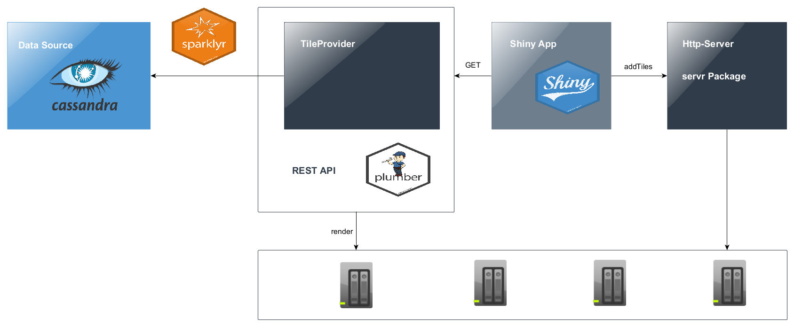

<style type="text/css">
.remark-slide-content {
    padding: 1em 4em 1em 4em;
    font-size: 22px;
}
</style>

## Smart Machines Europe

* A group at Samsung Semiconductor

* Founded in October 2018

* Focusing on advanced driver assistance systems

## Andreas Wittmann

* Data Scientist at Smart Machines Europe

* Prior:  
  * Data Scientist at MAN Truck & Bus
  * Data Scientist at BFFT 
  
* Released two R packages on CRAN (CreditMetrics and reliability)


---

## Motivation

* Usage of R Shiny in combination with Leaflet: 
  * To further investigate such data
  * To present a first prototype of a future data product to the user
  
* When using Leaflet, you can quickly exceed the volume of data that can be visualized efficiently

* A maximum of 10,000 data points for visualization seems appropriate here

---

## Shiny Basic parts

Shiny applications have two components: 

### ui.R

defines the user interface

### server.R

defines the server-side of the application

### global.R (optional)

everything inside this file is run only on startup of the application

* Loading Data
* Constant Variables
* Database Connections
* ...

---

## App using pure Leaflet

### global.R

Some random gps data points (about 2,000) in and around Munich were created 

```{r, eval=FALSE}
library(data.table) 
library(dplyr) 
library(leaflet) 

dat <- fread("data/route.csv")

dat.aug <- dat[, { 
  data.table(lat=lat + rnorm(10) / 10000,       
             lon=lon + rnorm(10) / 10000) 
}, by = 1:nrow(dat)]
```

After augmentation leaflet has to render 20,000 data points

---

## App using pure Leaflet

### server.R

```{r, eval=FALSE}
function(input, output, session) { 

  # Create the map 
  output$map <- renderLeaflet({ 
    leaflet() %>% 
*     addProviderTiles("CartoDB.DarkMatter") %>% 
*     addCircles(lng = dat.aug$lon, lat = dat.aug$lat) %>% 
*     setView(lng = 11.52284, lat = 48.15981, zoom = 10) 
}) 

  output$text <- renderText({ 
    paste0("showing ", nrow(dat.aug), " points") 
  }) 
}
```


---

## Tile Layer based Approach

* Pure Leaflet seems not to work well with huge amounts of data

* Clustering could reduce/condense the data, but we cannot visualize the complete data

* **Alternative:** use a tile layer based approach




---

## Data Source

* Import all data (about 2 million) into a NoSQL database, Apache Cassandra was chosen here.

* Calculate Mercator-Projection of all GPS data and use this in combination with the zoom level as partitioning key

```{sql query, eval=FALSE}
CREATE TABLE IF NOT EXISTS density.points ( 
    zoom int, 
    x int, 
    y int, 
    lat double, 
    lng double, 
    primary key ((zoom, x, y), lat, lng) 
);
```

* A **Tile** is therefore defined by zoom, x and y

---

## Create Spark Connection to Cassandra

```{r, eval=FALSE}
library(sparklyr) 
library(dplyr) 

# fill config 
config <- spark_config() 
config[["sparklyr.defaultPackages"]] <- 
  c("datastax:spark-cassandra-connector:2.3.0-s_2.11")
* config[["spark.cassandra.connection.host"]] <- host 
* config[["spark.cassandra.connection.port"]] <- as.integer(port)

# create spark connection 
private$sc <- spark_connect(master = "local[*]", 
                            version = "2.3.0", 
                            hadoop_version = 2.7, 
                            config = config) 

cass_tbl <- private$sc %>% 
* spark_read_source(
*   name = table, 
*   source = "org.apache.spark.sql.cassandra", 
*   options = list(keyspace = keyspace, table = table))
```


---

## Calculate Tile and Position

```{r,eval=FALSE}
## see geosphere::mercator 
calcTile = function(zoom, lat, lon) { 
  latRad <- pi/180 * lat 
  n <- 2^zoom 
  xTile <- n * ((lon + 180) / 360) 
  yTile <- n * (1 - (log(tan(latRad) + 1 / cos(latRad)) / pi)) 
             / 2      
  return(data.table(x=xTile, y=yTile)) 
} 

calcPosition = function(dat, xx, yy) { 
  dat[, x := x - xx] 
  dat[, y := y - yy] 
  dat[, y := 1.0 - y] 

  ## tileSize = 256 
  dat[, u := x * tileSize] 
  dat[, v := y * tileSize] 
  dat[, x := floor(u)] 
  dat[, y := floor(v)] 
}
```

---

## Render Tile

```{r, eval=FALSE}
renderTile = function(zoom, x, y) 
{ 
* fileNameWithPath <- paste0("tile/", zoom, "_", x, "_", y, ".png") 
* if (file.exists(fileNameWithPath)) { 
*   cat(paste0("chached zoom=", zoom, ", x=", x, ", y=", y, "\n")) 
*   return(NULL) 
* } 

  datTile <- private$calcTile(zoom, dat$lat, dat$lon) 
  private$calcPosition(datTile, x, y) 

* p <- ggplot(datTile) + geom_point(aes(x=x, y=y), colour = "blue", 
*   alpha=0.4, size=1.5) + ylim(1, private$tileSize) +  
*   xlim(1, private$tileSize)
    
  ## remove margins, labels and ticks from p 

* png(fileNameWithPath, width=private$tileSize, 
*     height=private$tileSize, units="px", bg = "transparent") 
* print(p) 
* dev.off() 
}
```


---

## Web Services

### REST Api

Create REST API to render tiles on port 7000

```{r, eval=FALSE}
#' @get /render/<z>/<x_from>/<x_to>/<y_from>/<y_to> 
render <- function(z, x_from, x_to, y_from, y_to) { 
  tileCreator$render(z, x_from, x_to, y_from, y_to) 
}
```

### Http Server

Create Http Server for serving tiles on port 4321

```{r, eval=FALSE}
library(servr) 
httd()
```

---

## App using Tile Layer based Approach

### server.R

```{r, eval=FALSE}
render <- reactive({ 
  bounds <- input$map_bounds 
  zoom <- input$map_zoom 
  if (!is.null(zoom) && !is.null(bounds)) { 
    tileNortWest <- calcTile(zoom = zoom, lat = bounds$north, 
                             lon = bounds$west)     
    tileSouthEast <- calcTile(zoom = zoom, lat = bounds$south, 
                              lon = bounds$east) 
    x_from <- as.character(round(tileNortWest$x) - 1) 
    x_to <- as.character(round(tileSouthEast$x) + 1) 
    y_from <- as.character(round(tileNortWest$y) - 1) 
    y_to <- as.character(round(tileSouthEast$y) + 1) 
*   url <- paste0("http://localhost:7000/render/", zoom, "/", 
*                 x_from, "/", x_to, "/", y_from, "/", y_to) 
*   httr::GET(url) 
  } 
* leafletProxy("map") %>% 
*   addTiles(
*     urlTemplate = "http://localhost:4321/tile/{z}_{x}_{y}.png", 
*     options = tileOptions(maxZoom = 19)) 
})
```


---

## Summary

* Alternatively to using pure Leaflet approach we can use a tile layer based one to render huge amounts of data.

* Depending on the size of data and the use case we have two possibilities: 
  * Render tiles on-the-fly per request
  * Render tiles in a batch run
  
* Sometimes it can take some time to render all tiles, so it seems reasonable to use the new future package to handle such asynchronous tasks.

---

### Thank you! Questions?

Demo: https://github.com/wittmaan/UseR2019

Contact: andreas_wittmann@gmx.de

Twitter: https://twitter.com/wittmaan1


### Literature

* Go implementation: https://github.com/fogleman/density

* https://en.wikipedia.org/wiki/Mercator_projection

* https://rstudio.github.io/leaflet/

* http://spark.rstudio.com/

